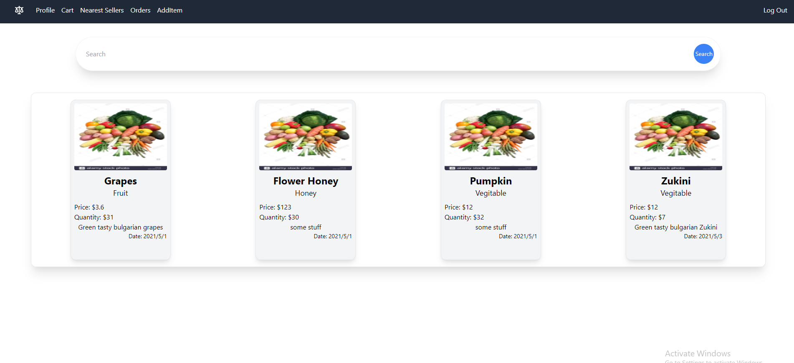
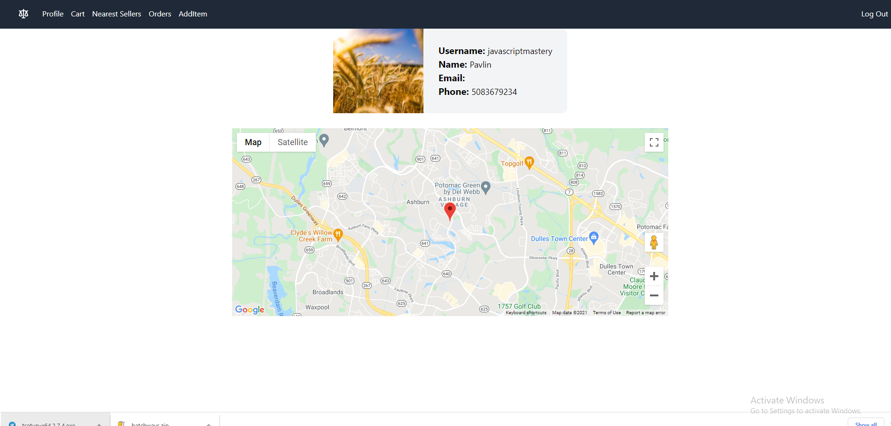
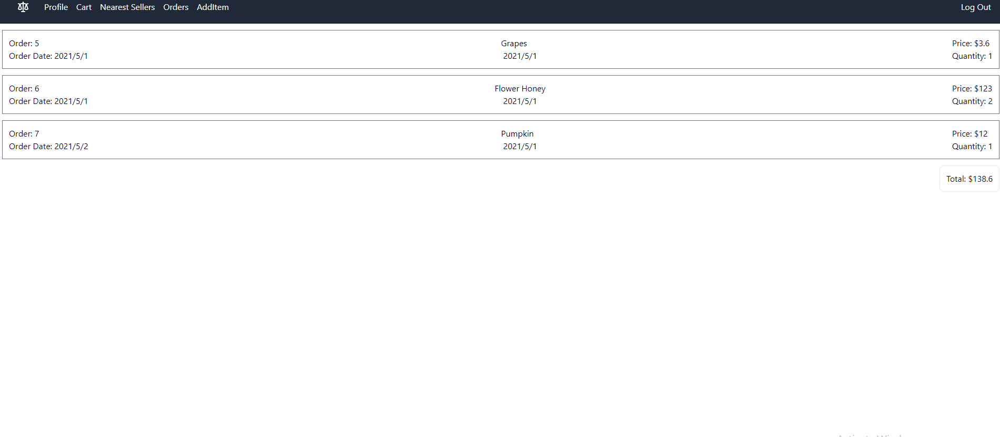
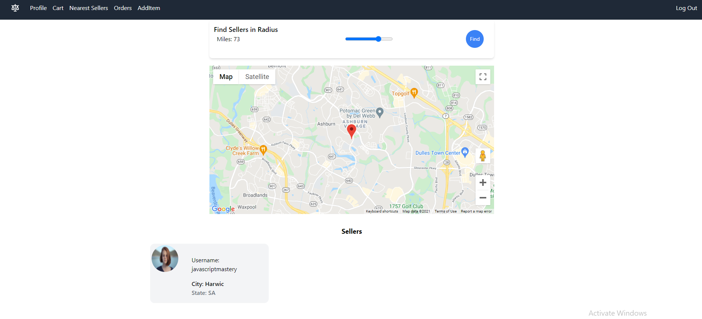
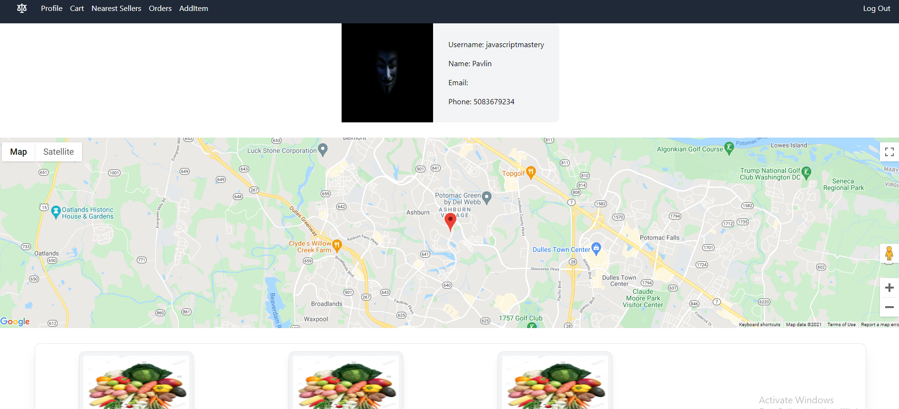
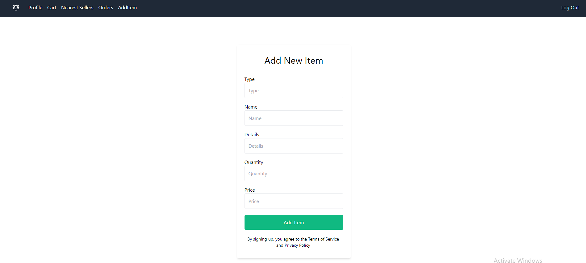

# Compleated Images

# Technologies

## Backend
* Node.js
* Express
* PostgreSQL
* JsonWebToken
* bcrypt
* cors
* cookie-parser
* Node pg

## Frontend
* React.js
* Redux / ReduxToolkit
* Axios
* React Router Dom
* JsonWebToken
* Universal Cookies
* TailwindCSS
* react-google-maps

# Type Of Application

>  This is going to be a mobile-friendly web page

# Goal 

> The goal of this application is to provide People who 
> grow their food with a marketplace and costumers
>  who wants to consume locally grown fruits, vegetables, and others.

# Demographic

### Costumers
* People Interested in Supporting locally grown produce
* People who would like to eat fresh from the farm

### Sellers
* People who would like to get into Gardening or Farming
* People with gardens or farms that would like to expand or look at different opportunities

# Data 

### User Data
* Name
* Email
* password
* location (as reference)
* address (for delivery optional)
* phone (optional)

### Sellers Data
* Name
* Email
* Phone
* Password
* address
* location (long, lat)

### Products Data
* type 
* quantity
* date
* price

# API

### Google Maps
> Using google maps I will load closest sellers of certain
> 
> product in x miles/km. 
>
> Using Nominatim maps will get long lat from sellers address for free
> and avoid google paid geocode API
> 
> Google maps will be used in multiple components. to give information Of
> product or user location

# Database

### Schema

# Expected difficulties

### Nominatim Api
* Getting turning addresses into long lat coordinates

### Google Api
* Loading markers in to google maps using long lat 

# Security

> Security will use bcrypt on the backend to encrypt passwords
> Front end will have a JWT token held in memory
> Refresh token will be used to refresh the main token and it will be
> held in cookies as HTTPOnly cookies for security purposes.
> On expiration Both tokens will be refreshed
> 
# Functionaliry

* Show buyers closest sellers and their Products
* Ability to search for products
* Ability to become a seller 
* Ability to create orders
* Ability to view orders as a seller
* Ability to view orders as a buyer
* Adding items to sell

# User flow

> When someone visits the website he will be greeted with
> a search bar and different products and see product details
> People that have registered will have the ability to purchase items from sellers and pick them up or get delivery if available.
> Users of the website will have the ability to become a seller and register their products.
> When a user is looking at the details page they will be able to see the distance to the seller and get route using google maps.